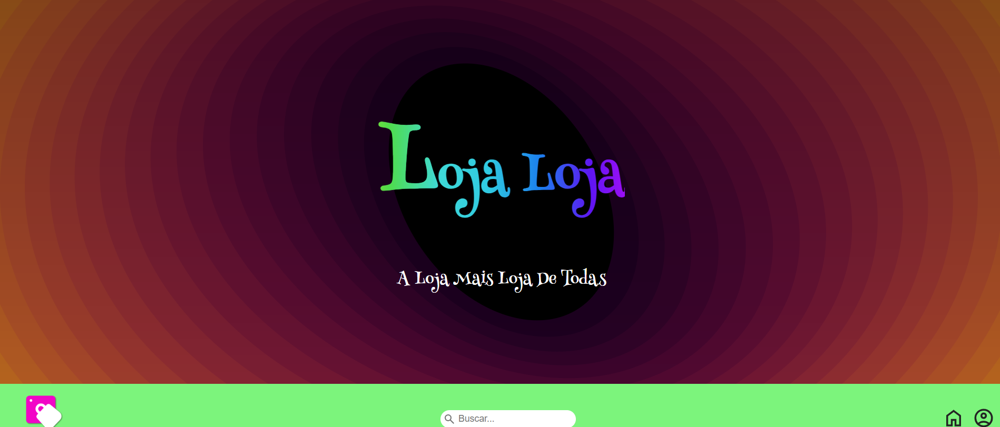
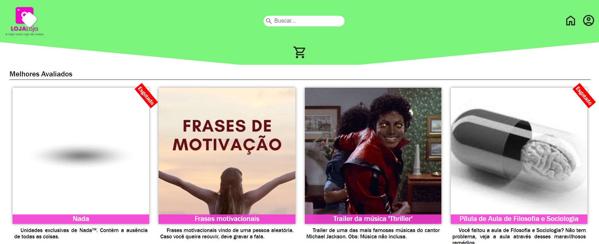
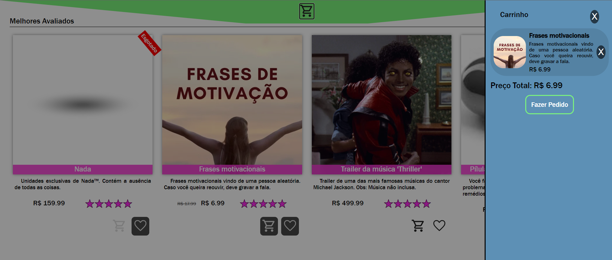

# Loja Loja

Esta é a documentação da loja virtual _Loja Loja: A Loja mais Loja de Todas_. Aqui falará sobre o site, tendo a descrição, os requisitos, local de hospedagem, anotações de desenvolvimento e como usar o git para desenvolver o site.

## Sumário

1. [Descrição](#descrição)
1. [Lista de Tarefas](#lista-de-tarefas)
1. [Desenvolvimento](#desenvolvimento)
    1. [Configurar no Git](#configurar-no-git)
    1. [Clonando o Repositório na Máquina](#clonando-o-repositório-na-máquina)
    1. [Criando o Banco de Dados](#criando-o-banco-de-dados)
    1. [Rodando o Servidor](#rodando-o-servidor)
    1. [Fazendo Alterações no Projeto](#fazendo-alterações-no-projeto)
    1. [Rodando o Front-End](#rodando-o-front-end)
1. [Requisitos](#requisitos)
    - [Requisitos Funcionais](#requisitos-funcionais)
    - [Requisitos Não Funcionais](#requisitos-não-funcionais)
1. [Objetivos](#objetivos)
1. [Linguagens Utilizadas](#linguagens-utilizadas)
1. [Design](#design)
1. [Ideias de Produtos](#ideias-de-produtos)
1. [Explicação do Código](#explicação-do-código)
    1. [Geral](#geral)
    1. [Front-End](#front-end)
    1. [Back-End](#backend)
1. [Banco de Dados](#banco-de-dados)
    1. [Entidades](#entidades)
    1. [Relações](#relações)
1. [Coleção Postman (Rotas Servidor)](#coleção-postman-rotas-servidor)
1. [Formatação e Convenções](#formatação-e-convenções)
1. [Imagens](#imagens)

## Descrição

_Loja Loja: A Loja mais Loja de Todas_ é uma loja virtual em que é possível visualizar e fazer a compra de diversos produtos e serviços, como um aperto de mão aleatório, o conceito de plano cartesiano, a cor rosa choque e unidades únicas de nada.

## Lista de Tarefas

-   [x] Documentação
    -   [x] Tutorial de como usar o git para desenvolver
    -   [x] Requisitos
    -   [x] Objetivos, descrição, linguagens utilizadas
    -   [x] Ideias de produtos
    -   [x] Formatação e convenções
    -   [x] Documentação final (imagens, etc)
-   [x] Design
    -   [x] Escolha de paleta de cores
    -   [x] Escolha de fontes
    -   [x] Design UI/UX
-   [x] Implementação
    -   [x] Base HTML
    -   [x] Estilização base CSS
    -   [x] Código JavaScript
    -   [x] JSON informações produtos
    -   [x] Banco de dados relacional criado com MySQL
    -   [x] Rotas criadas com Node.js e Express
    -   [x] Reformulação do front-end para requisições ao servidor
-   [x] Testes

## Desenvolvimento

Você precisa ter uma conta no github e ter sido colocado como colaborador do projeto para executar os passos abaixo.

### Configurar no Git

Caso não esteja configurado no Git, você deve colocar no git bash os comandos:

```
git config --global user.name "Nome de Usuário"
git config --global user.email "emailgithub@gmail.com"
```

### Clonando o repositório na máquina

É necessário fazer uma clonagem do repositório na sua máquina. Para isso, você deve colocar no git bash os comandos:

```
git clone https://github.com/bruno08nunes/loja-loja.git
cd loja-loja
```

### Criando o banco de dados

Para a criação do banco, é necessário acessar o arquivo db.sql, presente na pasta backend. O código deve ser copiado e colado no MySQL Workbench, com os comandos todos executados, apertando Ctrl + Enter.

Talvez seja necessário alterar o arquivo db_config.js, alterando a senha e o usuário para o usado no seu ambiente de desenvolvimento.

### Rodando o servidor

Para rodar o servidor, é necessário acessar a pasta do backend pelo git bash.

```
cd backend
```

Depois é necessário instalar as dependências, com o código abaixo.

```
npm i
```

Por fim, você precisa rodar o servidor.

```
npm start
```

### Fazendo alterações no projeto

Antes de começar a trabalhar, é sempre recomendado puxar as alterações feitas para a sua máquina, usando o comando:

```
git pull origin main
```

Também é recomendado criar uma nova branch para fazer as alterações. Você deve fazer usando:

```
git checkout -b dev
```

É recomendado que as alterações sejam feitas por etapas, de pouco a pouco. Você deve fazer um commit com as alterações feitas, colocando no git bash:

```
git add .
git commit -m "Mensagem descrevendo as alterações"
```

Depois é necessário apenas enviar para o repositório remoto. Caso você já esteja conectado entre o git e o github, você deve executar o primeiro código, se não, o segundo.

1.

```
git push -u origin main
```

2.

```
git push origin main
```

Caso haja mais dúvidas, veja: [Git e Github - Tutorial](https://docs.google.com/document/d/1UeFRh8nkwYq1HemMNNc_1RpyQb_FGNWZEEgKtZuF8Ko/edit)

### Rodando o front-end

É possível rodar o front-end de várias formas. A recomendada é pela extensão do VS Code: Live Server.

## Requisitos

Esta seção mostra as funcionalidades que o site precisa ter.

### Requisitos Funcionais

-   [rf1] - Página inicial com produtos à venda;
-   [rf2] - Header com nome do site, barra de pesquisa, link para conta do usuário e botão para vizualizar o carrinho;
-   [rf3] - Sidebar com produtos do carrinho que pode ser aberta e fechada. Os itens do carrinho são adicionados no Local Storage, permanecendo após fechar a página;
-   [rf4] - Pesquisa de produtos, aparecendo algum que tenha nome ou descrição condizente com o pesquisado;
-   [rf5] - Exibição de itens na página principal, divido por categorias, mostrando:
    -   Nome do produto;
    -   Parte da descrição;
    -   Preço;
    -   Botão para adicionar/remover da lista de desejo;
    -   Botão para adicionar/remover do carrinho; e
    -   Imagem;
-   [rf6] - Footer com formulário de cadastro, informações de contato, e informações de copyright;
-   [rf7] - Página de compra de cada item, exibindo todas as informações do produto, botão de compra, botão para adicionar/remover da lista de desejo, botão para adicionar/remover do carrinho, nota e avaliações;
-   [rf8] - Página de formulário de compra de item, colocando endereço e informações de compra;
-   [rf9] - Página de cadastro no site, com nome completo, email e senha. Essas informações ficam salvas no banco de dados;
-   [rf10] - Página de login, com as informações cadastradas anteriormente;
-   [rf11] - Página de atualização de perfilt, sendo possível mudar as informações e deletar a conta;
-   [rf12] - Página de perfil, que você pode colocar uma foto (fica salva no IndexedDB), ver lista de desejo, carrinho e algumas de suas informações;
-   [rf13] - Gerar PDF com informações de compra;
-   [rf14] - Usuários administradores poderem fazer o CRUD de produtos e categorias; e
-   [rf15] - Usuários poderem favoritas produtos.

### Requisitos Não Funcionais

-   [rnf1] - Responsividade. Funcionar independente do sistema operacional, tamanho de tela ou navegador;
-   [rnf2] - Pouco requisito de processamento;
-   [rnf3] - Pouco requisito de espaço;
-   [rnf4] - Pouco requisito de internet. Carregamento rápido;
-   [rnf5] - Ambiente seguro para o usuário;
-   [rnf6] - Interface fácil de manipular;
-   [rnf7] - Interface acessível;
-   [rnf8] - Disponibilidade alta; e
-   [rnf9] - Código limpo e reutilizável.

## Objetivos

O objetivo do projeto é criar uma loja virtual com um banco de dados funcional. Porém deve ter página de compra e carrinho. Serve para conseguirmos aprender sobre mais sobre HTML, CSS e JS, principalmente sobre Local Storage, além de backend com Node, Express e MySQL.

## Linguagens, Bibliotecas, Frameworks e Recursos Utilizados

-   HTML;
-   CSS;
-   JavaScript;
    -   Node.js;
    -   Express;
    -   html2pdf;
    -   nodemon;
    -   dotenv;
    -   mysql2; e
    -   cors.
-   MySQL.
-   APIs:
    -   viacep.

## Design

-   Cores:
    -   Rosa - #f205c7;
    -   Rosa Claro - #fc2aec;
    -   Verde - #7cf47c; e
    -   Azul - #5d90b5.
-   Fontes:
    -   Henny Penny;
    -   Quite Magical;
    -   Franklin Gothic Medium; e
    -   Arial.

## Ideias de Produtos

-   Aperto de mão de aleatório;
-   Unhas de anões;
-   Unidades de nada;
-   Frases motivacionais;
-   Plano cartesiano;
-   Teorema de Pitágoras;
-   "Indo Ali" esmagado;
-   Careca só a careca (pessoa não inclusa);
-   Rosa choque;
-   Salada de chupeta;
-   Graus celsius;
-   Um nerd (emoji);
-   Garantia de compra (impressão não inclusa);
-   Chuva (para usar seu mais novo guarda chuva Guarda chuva acoplado com uma formiga);
-   Entupidor de nariz;
-   Núcleo da terra;
-   Trailer da música "Thriller" do Michael Jackson (música não inclusa);
-   Bruno Emo<sup>TM</sup>;
-   Orelha em conserva;
-   Sor Árlan (fora de estoque);
-   Susto em uma caixa de sapato;
-   Pílula de dilema;
-   Pílula de aula de filosofia e sociologia do sor Árlan;
-   Sopro;
-   Micro-onda (onda, não aparelho);
-   Ansiedade; e
-   Letra do alfabeto árabe.

## Explicação do Código

### Geral

#### README.md

Documentação do projeto

#### LICENSE

Licença de copyright do site

#### .prettierrc

Arquivo com estilização padrão para o desenvolvimento do site, usado em conjunto com a extensão presente no Visual Studio Code e outras IDEs: Prettier.

#### .gitignore

Arquivo que serve para não levar arquivos que não devem ser colocados no github. Nesse caso, a pasta node_modules, instalada com npm install.

### Front-end

#### HTML

Há doze páginas html, cada uma com uma funcionalidade. Elas estão dentro da pasta pages. Elas são:

-   index - Página principal, que mostra os produtos que podem ser comprados. Única que não está na pasta pages;
-   form-create-account - Página de cadastro, acessada através do header;
-   form-login - Página de login, acessada através do header;
-   account - Página da conta, acessada através do header após logar;
-   form-update-account - Página para atualizar informações do usuário. Acessada através da página da conta do usuário;
-   product - Página que mostra um produto de forma individual, com todas as informações e comentários;
-   form-buy - Página de formulário para compra de itens. Acessível através do carrinho, caso haja produtos;
-   gerenciar - Página acessível através do header para administradores. Direciona para outras páginas;
-   form-create-categories - Página para a criação de categorias. Acessada através da página de gerenciar;
-   form-products - Página para a criação de produtos. Acessada através da página de gerenciar;
-   search-products - Página para admnistradores pesquisarem por produtos para alterar. Acessada através da página de gerenciar;
-   products-management - Página para a atualização e deletamento de produtos. Acessada através da página de procurar por produtos;

Todas as páginas possuem o mesmo cabeçalho, mesmo footer e mesmo carrinho, mudando apenas o main de cada parte e o hero na página principal. Além disso, caso você seja um administrador, o header possui um link a mais, que direciona para a página gerenciar.

#### CSS

O código css da página principal está no style.css, contendo também as partes de footer e header. As demais estão em arquivos dentro da pasta style, que contém o mesmo nome do css. Eles ainda seguem o style.css como base, sendo importados nessa folha de estilo.

Também há os arquivos cart.css para o carrinho e o media-query.css para responsividade de todo o site. Ambos são importados no style.css.

#### JavaScript

O código é separado em diversos módulos, que apararecem na pasta módulos. Há um para a inicialização de cada página, que pode alterar a página com base em dados vindo do local storage ou do banco de dados.

São separados também em criarProduto, que é usado na página principal e na conta e atualizarCarrinho que é usado em todas as páginas.

No arquivo principal (script.js) é feita uma requisição para o banco de dados, iniciando a página, funcionalidades para o header, footer e carrinho, inicialização do indexedDB e verificação se o usuário é um administrador ou não..

#### assets

Pasta que contém as imagens, vídeos e fontes usadas. Separada em

-   fonts - Fontes
-   examples - Prints do site para documentação
-   products - imagem dos produtos
-   icons - ícones como carrinho, coração, conta, entre outros
-   background.svg - Fundo do hero do index
-   favicon.png - Imagem favicon do site
-   logo.png - Logo que aparece no header

### Backend

#### package.json e package-lock.json

Informações sobre as dependências do projeto. A primeira pode sofrer algumas alterações, como na parte de scripts, enquanto a segunda não deve ser alterada.

#### node_modules

Pasta com as dependências do projeto, instalada com npm i. Não deve ser alterada ou enviada para o Github de forma nenhuma.

#### db.sql

Contém os comando SQL necessários para criar o banco de dados relacional MySQL da aplicação. Cada comando deve ser utilizado no MySQL Workbench, apertando Ctrl + Enter.

#### modelo-banco-de-dados.mwb

Contém o modelo do banco de dados, que foi usado de base para a criação do banco.

#### src

Contém os arquivos JavaScript usados no backend. No caso:

-   db_config.js - Contém as configurações para acessar o banco de dados; e
-   server.js - Contém as rotas usadas para acessar o banco.

## Banco de Dados

### Entidades

users - Usuários da aplicação. Contém os atributos:
-   id - Auto increment;
-   first_name - Primeiro nome;
-   family_name - Sobrenome;
-   email;
-   password - Senha;
-   cpf;
-   role - Cargo, que pode ser "U" (usuário) ou "A" (administrador);
-   created_at - Tempo de criação; e
-   updated_at - Tempo de última alteração.

products - Produtos
-   id - Auto increment;
-   name - Nome do produto;
-   description - Descrição;
-   price - Preço;
-   promotional_price - Preço em promoção;
-   stock_quantity - Quantidade em estoque;
-   image - URL da imagem;
-   created_at - Tempo de criação; e
-   updated_at - Tempo da última alteração.

categories - Categorias
-   id - Auto increment;
-   name - Nome da categoria; e
-   description - Descrição.

products_has_categories - Entidade associativa entre produtos e categorias
-   id_products - id do produto (chave estrangeira); e
-   id_categories - id da categoria (chave estrangeira).

reviews - Uma entidade associativa entre usuários e produtos
-   id - Auto increment;
-   id_users - id do usuário (chave estrangeira);
-   id_products - id do produto (chave estrangeira);
-   rating - Nota;
-   comment - Comentário;
-   created_at - Tempo de criação; e
-   updated_at - Tempo da última alteração.

favorites - Uma entidade associativa entre usuários e produtos
-   id_users - id do usuário (chave estrangeira);
-   id_products - id do produto (chave estrangeira); e
-   favorited_at - Tempo em que foi favoritado.

orders - Tabela de compras
-   id - Auto increment;
-   id_users - id do usuário (chave estrangeira);
-   payment_metod - Método de pagamento;
-   shipping_postcode - CEP;
-   house_number - Número da residência; e
-   created_at - Tempo de criação.

orders_has_products - Entidade associativa entre pedidos e produtos
-   id_orders - id do pedido (chave estrangeira);
-   id_products - id do produto (chave estrangeira);
-   quantity - Quantidade de compra; e
-   price - Preço do produto na época da compra.

### Relações

users:
-   products:
    -   n/m - Entidade associativa reviews; e
    -   n/m - Entidade associativa favorites.
-   orders:
    -   1/n.

products:
-   users:
    -   n/m - Entidade associativa reviews; e
    -   n/m - Entidade associativa favorites.
-   categories:
    -   n/m - Entidade associativa products_has_categories.
-   orders:
    -   n/m - Entidade associativa orders_has_products.

orders:
-   users:
    -   n/1.
-   products:
    -   n/m - Entidade associativa orders_has_products.

categories:
-   products:
    -   n/m - Entidade associativa products_has_categories.

## Coleção Postman (Rotas Servidor)

### Cadastrar usuário

Método: POST

Rota (com link): http://localhost:3000/usuario/cadastrar

Exemplo de Corpo: {
    "nome": "Bruno",
    "sobrenome": "Nunes",
    "email": "exemplo@gmail.com",
    "senha": "admin123",
    "cpf": "12345678910"
}

### Login de usuário

Método: POST

Rota (com link): http://localhost:3000/usuario/login

Exemplo de Corpo: {
    "email": "exemplo@gmail.com",
    "senha": "admin123"
}

### Informações de usuário

Método: GET

Rota (com link): http://localhost:3000/usuario/informacoes/:id

### Atualização de usuário

Método: PUT

Rota (com link): http://localhost:3000/usuario/atualizar/:id

Exemplo de Corpo: {
    "nome": "Felipe",
    "sobrenome": "Coimbra",
    "email": "exemplo@gmail.com",
    "senha": "admin123",
    "cpf": "12345678910"
}

### Deletar usuário

Método: DELETE

Rota (com link): http://localhost:3000/usuario/deletar/:id

### Criar produto

Método: POST

Rota (com link): http://localhost:3000/produto/criar

Exemplo de Corpo: {
    "nome": "Chocolate",
    "descricao": "Chocolate maravilhoso!",
    "preco": 5.99,
    "precoPromocional": 2.99,
    "quantidade": 8,
    "image": "bruno-emo.jpg"
}

### Listar todos os produtos

Método: GET

Rota (com link): http://localhost:3000/produtos/listar

### Informações de um produto

Método: GET

Rota (com link): http://localhost:3000/produto/informacoes/:id

### Atualização de produtos

Método: PUT

Rota (com link): http://localhost:3000/produto/atualizar/:id

Exemplo de Corpo: {
    "nome": "Pirulito",
    "descricao": "Pirulito amarelo.",
    "preco": 5.99,
    "precoPromocional": 2.99,
    "quantidade": 8,
    "image": "bruno-emo.jpg"
}

### Deletar produtos

Método: DELETE

Rota (com link): http://localhost:3000/produto/deletar/:id

### Listar todos os produtos por ordem de maior avaliação

Método: GET

Rota (com link): http://localhost:3000/produtos/listar/melhores

### Criar Categoria

Método: POST

Rota (com link): http://localhost:3000/categoria/criar

Exemplo de Corpo: {
    "nome": "Decoração",
    "descricao": "Itens que podem ser utilizados como decoração para casa."
}

### Listar Categorias

Método: GET

Rota (com link): http://localhost:3000/categorias/listar

### Criar Categoria em Produtos

Método: POST

Rota (com link): http://localhost:3000/produto/categoria/criar

Exemplo de Corpo: {
    "produto": 5,
    "categorias": [
        1,
        2,
        3
    ]
}

### Selecionar produto por categoria

Método: GET

Rota (com link): http://localhost:3000/categoria/produto/selecionar/2

### Deletar Categoria em Produtos

Método: DELETE

Rota (com link): http://localhost:3000/categoria/produto/deletar/1

### Favoritar Produto

Método: POST

Rota (com link): http://localhost:3000/produto/favoritar

Exemplo de Corpo: {
    usuario: 1,
    produto: 1
}

### Verificar se o produto está favoritado pelo usuário

Método: GET

Rota (com link): http://localhost:3000/favoritos/produto

### Verificar todos os favoritos do usuário

Método: GET

Rota (com link): http://localhost:3000/usuario/favoritos/1

### Verificar todos os favoritos do usuário

Método: DELETE

Rota (com link): http://localhost:3000/favoritos/produto/remover

Exemplo de Corpo: {
    usuario: 1,
    produto: 1
}

## Formatação e Convenções

Por padrão, os códigos do projeto devem seguir:

-   Geral:
    -   Quatro (4) espaços para indentação do código. Para facilitar isso, você deve instalar a extensão Prettier.
-   HTML:
    -   Uso de HTML semântico, evitando o uso de `<div>` e `<span>` e priorizando o uso de `<section>`, `<article>`, entre outros;
-   CSS:
    -   Uso de _Flebox_ e _Grid Layout_ sempre que possível;
    -   Uso de classes para estilização em CSS. Podem ser usados outros seletores também, mas evitando o uso de tags e IDs;
    -   Nome de classes coerente, com palavras separadas por - (como: `header-principal`); e
    -   Declarações organizadas em grupos: (como: Posicionamento, Box model, Tipografia e Visual).
-   JavaScript:
    -   Nome de variáveis em português, sem acento;
    -   Nome de variáveis coerentes, com palavras separadas por _camelCase_ (como: `carrinhoDeProdutos`); e
    -   Variáveis declaradas apenas com `let` e `const`.
-   Banco de Dados:
    -   Nome das entidades e tabelas em inglês;
    -   Nome das entidades e tabelas separadas por snake_case; e
    -   Criação lógica do banco, seguindo os padrões para a criação.

## Imagens



